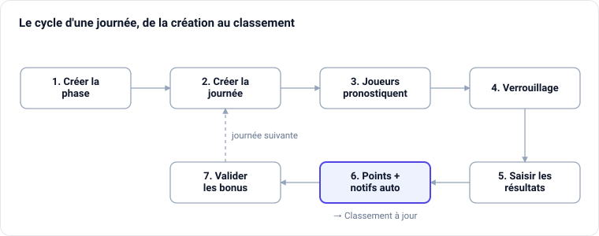

# Guide administrateur — Prono Ping

Ce guide explique comment administrer l'application de pronostics du club.

## Vue d'ensemble

L'application fait vivre un concours de pronostics de tennis de table pour le club : les joueurs prédisent les scores des rencontres, l'admin saisit les vrais résultats, et le classement se met à jour automatiquement.

Ton rôle d'admin suit toujours le même cycle :

1. Créer une **phase** (une période de la saison).
2. Ajouter les **rencontres** de chaque journée, avec leur date limite de pronostic.
3. Les **joueurs pronostiquent** tant que le match n'est pas verrouillé.
4. Après le match, tu **saisis le score réel** → les points sont calculés tout seuls et les joueurs sont notifiés.
5. Tu **valides les questions bonus** s'il y en a.

## Les concepts clés

Cinq mots reviennent partout dans l'app. Une fois compris, tout le reste coule de source.

| Terme | Ce que c'est |
| --- | --- |
| **Phase** | Une période de la saison (date de début → date de fin). Les joueurs pronostiquent sur la phase en cours. |
| **Journée** | Un outil pour créer plusieurs rencontres d'un coup, rattachées à une phase, avec éventuellement des questions bonus. |
| **Rencontre (match)** | Une confrontation équipe 1 vs équipe 2, jouée en **14 ou 18 matchs** individuels (le score va de 0 à ce nombre). |
| **Date de fin des pronostics** | L'instant où la rencontre se **verrouille** : après, plus personne ne peut pronostiquer ni poser de joker. |
| **Phase courante** | Celle dont la date du jour est comprise entre le début et la fin : c'est là que les joueurs voient les matchs à pronostiquer. |

## Démarrage : le menu d'administration

Connecte-toi avec ton compte administrateur : un menu d'administration supplémentaire apparaît dans la barre latérale, en plus des écrans joueurs (Pronostics, Classement, Calendrier, Bonus).

Les entrées d'admin :

- **Phases** — créer et gérer les périodes de la saison.
- **Journées** — ajouter en une fois toutes les rencontres d'une journée (+ questions bonus).
- **Matchs** — la liste des rencontres ; c'est ici qu'on **saisit les résultats** et qu'on modifie une rencontre.
- **Questions bonus** — gérer les questions et **valider les réponses**.
- **Utilisateurs** — gérer les joueurs (rôles, suppression).
- **Apparence** — couleurs, logo et mode sombre du site.

## Gérer les phases

Une phase délimite une portion de la saison. Crée-la **avant** d'ajouter des rencontres, car chaque rencontre est rattachée à une phase.

1. Menu **Phases → Nouvelle phase**.
2. Donne un **nom** (ex. « Phase 1 », « Poule A ») et une **date de début** + **date de fin**.
3. Enregistre.

La **phase courante** est celle dont la date du jour tombe entre le début et la fin : c'est elle que les joueurs voient sur l'écran Pronostics. Évite donc de faire se chevaucher deux phases sur les mêmes dates.

## Créer une journée

C'est le moyen le plus rapide de mettre en place toute une journée de rencontres d'un seul coup.

1. Menu **Journées → Créer une journée**.
2. Choisis la **phase** de rattachement.
3. Pour **chaque rencontre**, renseigne :
    - l'**équipe 1** et l'**équipe 2** (elles doivent être différentes) ;
    - le **nombre de matchs** : **14 ou 18** (il fixe le score maximum possible) ;
    - la **date et l'heure** de la rencontre.
4. Ajoute autant de rencontres que nécessaire.
5. Facultatif : jusqu'à **3 questions bonus** (intitulé + description). Seules celles dont l'intitulé est rempli sont créées.
6. Enregistre : toutes les rencontres et questions sont créées en une fois.

Astuce : tu peux toujours ajuster une rencontre ensuite via le menu **Matchs**.

## Saisir un résultat de match

C'est l'action qui fait vivre le classement. Dès qu'une rencontre est jouée :

1. Menu **Matchs**, trouve la rencontre.
2. Saisis le **score réel** de chaque équipe (entre 0 et le nombre de matchs, 14 ou 18).
3. Enregistre.

En un clic, l'app :

- marque la rencontre comme **résultat saisi** ;
- **recalcule automatiquement les points** de tous les pronostics de cette rencontre ;
- **notifie les joueurs** concernés que le résultat est tombé.

Tu peux corriger un score plus tard : les points sont simplement recalculés.

## Le barème de points

Les points d'une rencontre sont attribués automatiquement dès que tu saisis le résultat.

| Situation du pronostic | Points |
| --- | --- |
| **Score exact** (les deux scores justes) | 3 |
| **Bon vainqueur** seulement | 1 |
| Mauvais pronostic | 0 |
| **Joker** posé sur la rencontre | points × 2 |
| **Question bonus** juste (validée par l'admin) | 5 |

**Le joker** : chaque joueur peut poser **un seul joker par phase** sur la rencontre de son choix (avant verrouillage). Il **double** les points de ce pronostic — un score exact jokerisé rapporte donc 6 points.

## Valider les questions bonus

Les questions bonus rapportent **5 points** chacune, mais contrairement aux matchs, elles ne se calculent pas seules : c'est toi qui tranches.

1. Menu **Questions bonus**.
2. Ouvre la question et définis la **bonne réponse**.
3. Pour chaque réponse de joueur, **accorde** (5 points) ou **retire** (0 point) les points.

Tu dois d'abord fixer la bonne réponse avant de pouvoir accorder des points. Tu peux revenir ajuster une réponse à tout moment.

## Gérer les joueurs

Menu **Utilisateurs** : la liste de tous les comptes.

- **Changer le rôle** : passe un joueur en **admin** (accès au menu d'administration) ou l'inverse.
- **Supprimer** un compte devenu inutile.

⚠️ Garde toujours **au moins un admin** (le tien), et attribue le rôle admin avec parcimonie : un admin peut tout modifier, y compris les scores et les points.

## Personnaliser l'apparence

Menu **Apparence** : adapte le site aux couleurs du club, en direct.

- **Couleurs par zone**, réglables indépendamment : **Boutons & accents**, **Header** (barre du haut), **Navbar** (menu de gauche) et **Fond des pages**. Chaque zone a son sélecteur de couleur ; le texte s'adapte automatiquement (clair ou foncé) pour rester lisible.
- **Thèmes prédéfinis** : un clic applique une palette cohérente à toutes les zones.
- **Aperçu en direct** à droite, avec une bascule **soleil / lune** pour voir le rendu en clair **et** en sombre avant d'enregistrer.
- **Logo** : téléverse le logo du club (PNG, JPG, WEBP ou SVG, 2 Mo max) ; il apparaît dans le menu et sur la page de connexion.

Le **mode sombre** est disponible pour tous via l'icône lune / soleil en haut à droite du site ; le choix de chaque visiteur est mémorisé sur son appareil.

## Notifications

L'app tient les joueurs informés automatiquement, y compris par **notification push** sur leur téléphone (s'ils l'ont autorisée).

- **Résultat saisi** : quand tu enregistres le score d'une rencontre, les joueurs concernés sont prévenus.
- **Rappels avant la date limite** : un rappel automatique invite les joueurs à pronostiquer avant le verrouillage.

Chaque joueur retrouve l'historique dans l'icône **cloche** en haut à droite et sur la page **Notifications**.

## Déroulé type d'une saison

Chaque journée reprend le même cycle :

Une fois les résultats saisis et les questions bonus validées, le classement est à jour et tu passes à la journée suivante.
