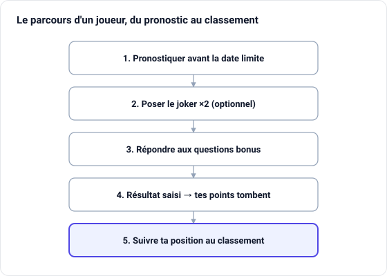

# Guide du joueur — Prono Ping

Ce guide explique comment participer au concours de pronostics du club.

## Le principe

Tu prédis les scores des rencontres de tennis de table du club. Plus tes pronostics sont justes, plus tu marques de points, et plus tu montes au classement. Chaque **phase** de la saison a son propre classement.

## Se connecter

Connecte-toi avec ton **pseudo** et ton **mot de passe** sur la page d'accueil. Depuis ton téléphone, tu peux « Ajouter à l'écran d'accueil » pour utiliser l'app comme une vraie application.

## Faire ses pronostics

1. Va dans **Pronostics** : tu vois les rencontres de la phase en cours.
2. Pour chaque rencontre, indique le **score que tu prédis** pour chaque équipe (entre 0 et le nombre de matchs, 14 ou 18).
3. Enregistre. Tu peux **modifier** ton pronostic autant que tu veux… **tant que la rencontre n'est pas verrouillée**.

⏰ **Date limite** : chaque rencontre a une heure de fermeture des pronostics. Une fois cette heure passée, la rencontre est **verrouillée** et ton pronostic ne peut plus être changé. Pense à pronostiquer à l'avance !

## Le joker (×2)

Le joker **double les points** d'un pronostic.

- Tu as **un seul joker par phase**.
- Pose-le sur la rencontre où tu te sens le plus sûr (fais d'abord ton pronostic, puis active le joker).
- Tu peux le **déplacer** sur une autre rencontre tant que celle-ci n'est pas verrouillée.

## Le barème de points

| Situation | Points |
| --- | --- |
| **Score exact** (les deux scores justes) | 3 |
| **Bon vainqueur** seulement | 1 |
| Mauvais pronostic | 0 |
| Pronostic avec **joker** | points × 2 |
| **Question bonus** juste | 5 |

Un score exact avec joker rapporte donc **6 points**.

## Les questions bonus

Certaines journées proposent des **questions bonus** (jusqu'à 3).

1. Va dans **Bonus**.
2. Réponds à chaque question tant qu'elle n'est pas résolue.
3. Après la rencontre, l'admin valide les bonnes réponses : chaque bonne réponse te rapporte **5 points**.

## Suivre le classement

- **Classement** : ta position et celle des autres joueurs pour la phase en cours.
- **Calendrier** : les rencontres à venir et passées, avec la date du jour mise en évidence.

## Notifications

L'app te tient au courant automatiquement :

- un **rappel** avant la fermeture des pronostics ;
- une **notification** quand le résultat d'une rencontre est saisi.

Tu retrouves l'historique via l'icône **cloche** en haut à droite et sur la page **Notifications**. Autorise les notifications push depuis ton profil pour les recevoir sur ton téléphone.

## Ton profil et le thème

- **Profil** : modifie ton pseudo, ton mot de passe et ton avatar.
- **Mode clair / sombre** : bascule avec l'icône **lune / soleil** en haut à droite. Ton choix est mémorisé sur ton appareil.

## En résumé

Bon concours ! 🏓
